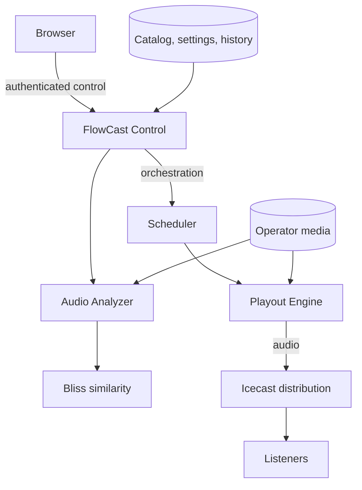

# Self-hosted radio automation, scheduling and playout — under your control.

**FlowCast is a self-hosted radio automation, scheduling and playout platform built for operators who want full control over their broadcast infrastructure.** Community packages the authenticated control plane and versioned broadcast services for an operator-managed Linux host; the service images are separately licensed and this repository does not claim that their source is open.

**Automate · Broadcast · Stay independent**

[Quick Start](#installation) · [Documentation](docs/README.md) · [Releases](https://github.com/chourmovs/FlowCast-Community/releases) · [Security](SECURITY.md) · [Support](SUPPORT.md)

[](https://github.com/chourmovs/FlowCast-Community/releases) [](https://github.com/chourmovs/FlowCast-Community/actions/workflows/validate.yml) [](LICENSE) 

## Product preview

No product image is committed yet: this documentation runner cannot launch a verified rc.7 instance, and the repository will not substitute an invented mockup. The first preview will be a sanitized capture of the authenticated dashboard and Now Playing view produced through the [real-instance capture procedure](docs/assets/screenshots/README.md).

## Why FlowCast

| Operator control | Scheduling and automation | Integrated broadcast chain | Operations and diagnostics |
| --- | --- | --- | --- |
| Run the stack and retain its state on infrastructure you administer. | Organize stations, media and playlists into scheduled programming. | Coordinate analysis, transition-aware playout and Icecast delivery. | Inspect health, history and sanitized diagnostics; back up, update and restore deliberately. |

## Features

The Community runtime contract currently qualifies: authenticated control; station configuration; playlists and media library; scheduling; Rust playout engine; audio analysis and similarity processing with bliss; transitions; engine history; Icecast streaming; backup and restore; controlled updates; `doctor.sh` diagnostics; and opt-out Docker Control. See the [runtime contract](docs/community/runtime-contract.md) and [known limitations](docs/community/known-limitations.md).

> **Docker Control:** enabling the Docker socket gives the `control` service effectively root-equivalent control of the host. Enable it only for trusted administrators; see the [Docker Control guide](docs/how-to/docker-control.md).

## Screenshots

Real screenshots will be published only after capture from a qualified Community instance and a sanitization review. Until then, the gallery records its intended coverage without committing stand-in graphics.

| Planned capture | What it will demonstrate | Status |
| --- | --- | --- |
| Dashboard and Now Playing | Authenticated overview and current playout state | Awaiting verified rc.7 capture |
| Programming and Upcoming | Schedule configuration and interpreted upcoming sequence | Awaiting verified rc.7 capture |
| Playlists and library | Playlist organization and imported media | Awaiting verified rc.7 capture |
| Supervision and service controls | Health, sanitized logs and Docker Control operations | Awaiting verified rc.7 capture |

See the [capture and publication procedure](docs/assets/screenshots/README.md).

## Community Edition

Community works without a paid licence, starts and broadcasts without a mandatory remote licence call, retains the essential broadcast path, and receives best-effort community support. Pro is optional and separately licensed; no undefined Pro feature is promised. Read [Community versus Pro](docs/community/community-vs-pro.md).

## Installation

**Requirements:** Linux amd64, Docker Engine, Docker Compose v2, 2 CPU cores, at least 4 GB RAM, 10 GB free disk plus media, and free TCP ports **8080** (control/player proxy) and **8010** (direct Icecast).

```bash
curl -fsSL https://raw.githubusercontent.com/chourmovs/FlowCast-Community/v0.1.0-rc.7/install.sh | sudo bash -s -- --version 0.1.0-rc.7
```

The tagged rc.6 command above remains the currently validated installation command while rc.7 is prepared. The installer writes `/opt/flowcast`, generates credentials, pulls versioned images and waits for service health. It does not install Docker.

> **Security note:** the default rc.6 install enables Docker Control. Mounting the Docker socket is equivalent to granting root-level host control to the container. Use `--no-docker-control` to opt out, and never expose the control UI to untrusted users. See [Security](SECURITY.md).

## First broadcast

1. Run the tagged installer above.
2. Open `http://localhost:8080` and sign in with the locally generated credentials.
3. Import operator-owned or freely licensed audio.
4. Create or select a playlist.
5. Configure its programming in the authenticated interface.
6. Start playout (Docker Control must be enabled for UI service controls).
7. Listen at `/listen/test.mp3` through the control origin or `http://HOST:8010/test.mp3` directly.
8. Verify the installation with `sudo /opt/flowcast/scripts/community/doctor.sh`.

Follow the complete [first broadcast guide](docs/how-to/first-broadcast.md).

## Architecture



Control, orchestration, analysis, audio playout, distribution and named-volume storage are isolated roles. Details are in [Architecture](docs/community/architecture.md).

## Community versus Pro

| Community | Pro |
| --- | --- |
| Autonomous broadcast path; no paid licence or mandatory licensing service | Optional, separate commercial licence |
| Essential control, scheduling, playout, streaming and operations | May add separately documented advanced functions or services |
| Best-effort community support | Commercial terms apply only when explicitly offered |
| Continues operating if an optional Pro licensing service is unavailable | Pro entitlement failure must not interrupt Community broadcasting |

## Documentation

- **Getting started:** [Quick start](docs/community/quick-start.md), [first broadcast](docs/how-to/first-broadcast.md)
- **Broadcasting:** [Import music](docs/how-to/import-music.md), [playlists](docs/how-to/create-playlist.md), [programming](docs/how-to/schedule-programming.md)
- **Operations:** [Backup, update and rollback](docs/how-to/backup-update-rollback.md), [Docker Control](docs/how-to/docker-control.md)
- **Security:** [Security policy](SECURITY.md), [reverse proxy and TLS](docs/how-to/reverse-proxy-tls.md)
- **Architecture:** [System architecture](docs/community/architecture.md), [runtime contract](docs/community/runtime-contract.md)
- **Troubleshooting:** [Stream troubleshooting](docs/how-to/troubleshoot-stream.md), [known limitations](docs/community/known-limitations.md)

Browse the complete [documentation index](docs/README.md).

## Legal and licensing

Repository scripts and documentation are MIT licensed. FlowCast Community OCI images use the licence declared in their published image metadata; third-party components retain their own licences; Pro uses separate commercial terms; and trademark rights are separate. Review the [licensing guide](docs/legal/licensing.md), [third-party notices](THIRD_PARTY_NOTICES.md), [trademarks](TRADEMARKS.md), [privacy](PRIVACY.md) and [disclaimer](DISCLAIMER.md). The software is supplied without warranty and operators remain responsible for infrastructure, data, broadcasts and applicable rights.

## Built with

FlowCast's distributed runtime uses Python, Rust, FastAPI, NiceGUI, GStreamer, FFmpeg, Icecast, bliss-audio, SQLite and Docker. Each remains an independent project under its own terms.

## Acknowledgements

We thank the maintainers and contributors of the technologies that make self-hosted broadcasting possible. See [Acknowledgements](ACKNOWLEDGEMENTS.md) and [Third-party notices](THIRD_PARTY_NOTICES.md); no third-party affiliation or endorsement is implied.

## Contributing and support

Use [issues](https://github.com/chourmovs/FlowCast-Community/issues) for reproducible sanitized bugs and feature requests, and [Discussions](https://github.com/chourmovs/FlowCast-Community/discussions) if enabled for community questions. Read [Contributing](CONTRIBUTING.md) and [Support](SUPPORT.md). Report vulnerabilities only through [private security reporting](SECURITY.md)—never in a public issue.
